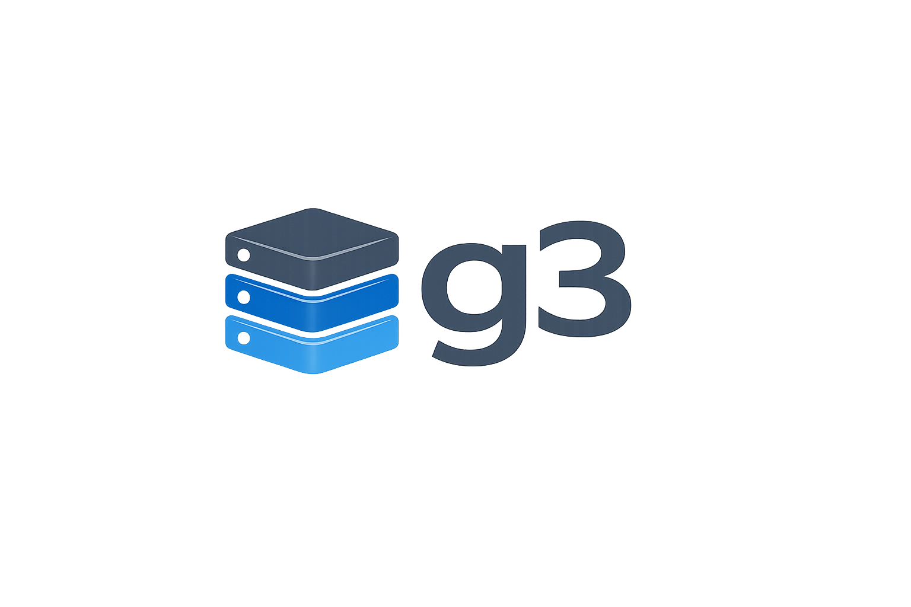

<p align="center">
  
</p>

# g3

An S3-compatible HTTP gateway that uses Gmail as the storage backend.

Objects are stored as emails — metadata in the body, data as attachments. Buckets map to Gmail labels. Designed for write-once/read-rarely workloads like offsite backups.

## How It Works

| S3 Concept | Gmail Mapping |
|---|---|
| Bucket | Gmail label (`s3/bucket-name`) |
| Object | Email with attachment |
| Object key | Email subject (`s3://bucket/path/to/key`) |
| Object metadata | JSON in email body |
| ETag | MD5 hex digest of content |
| Large objects | Chunked across multiple emails |

## Features

- S3-compatible API (PutObject, GetObject, HeadObject, DeleteObject, ListObjectsV2, ListBuckets)
- SigV4 request authentication
- Prometheus metrics (`g3_` prefix)
- OpenTelemetry tracing with log/span correlation
- Structured JSON logging via `log/slog`
- Chunked storage for objects exceeding Gmail's 25MB attachment limit
- YAML configuration with environment variable expansion
- Graceful shutdown
- Health checks (liveness + readiness)

## Getting Started

```bash
# Build
make build

# Validate config
./g3 validate -config config.yaml

# Run
./g3 -config config.yaml
```

## Configuration

```yaml
server:
  listen_addr: "0.0.0.0:9000"
  log_level: "info"

gmail:
  credentials_file: "/path/to/credentials.json"
  token_file: "/path/to/token.json"

buckets:
  - name: "backups"
    credentials:
      - access_key_id: "mykey"
        secret_access_key: "mysecret"

telemetry:
  metrics:
    enabled: true
  tracing:
    enabled: false
    endpoint: "tempo:4317"
```

## Usage

Once running, use any S3 client pointed at the gateway:

```bash
aws --endpoint-url http://localhost:9000 s3 cp backup.tar.gz s3://backups/daily/backup.tar.gz
aws --endpoint-url http://localhost:9000 s3 ls s3://backups/daily/
aws --endpoint-url http://localhost:9000 s3 cp s3://backups/daily/backup.tar.gz ./restored.tar.gz
```

## Project Structure

```
cmd/g3/           Entry point and subcommands
internal/
  audit/           Request ID propagation and audit logging
  auth/            SigV4 authentication and bucket registry
  backend/         Gmail storage backend (ObjectBackend interface)
  config/          YAML configuration loading and validation
  server/          S3 HTTP request routing and handlers
  telemetry/       Prometheus metrics, OpenTelemetry tracing, log correlation
```

## License

MIT
